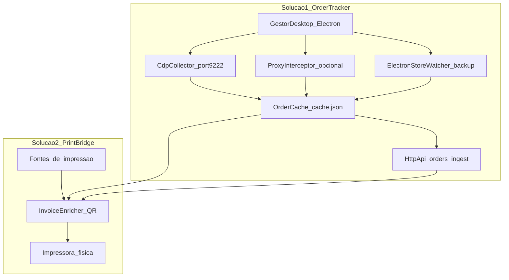
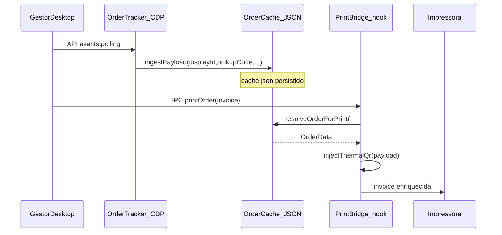

# Arquitetura — Order Tracker + Print Bridge

Este documento descreve as **duas soluções distintas** implementadas neste repositório, como elas se conectam hoje e quais caminhos de deployment usar em cada cenário.

## Visão geral

O projeto resolve dois problemas independentes que se encontram no fluxo de impressão de comandas do **Gestor de Pedidos Desktop**:

1. **Order Tracker** — captura dados de pedidos em tempo real (via CDP) e os disponibiliza em cache + API local.
2. **Print Bridge** — intercepta comandas antes da impressora, consulta os dados do pedido, injeta QR code e encaminha para a impressora física.

Hoje ambas rodam no **mesmo processo Node.js** (`QrService` em `src/service/main.ts`), compartilhando `OrderCache` in-process. Conceitualmente são soluções separadas; operacionalmente são um monolito com contrato HTTP local opcional.



### Comparação de responsabilidades

| Dimensão | Order Tracker | Print Bridge |
|----------|---------------|--------------|
| **Problema** | Capturar dados de pedidos do Gestor em tempo real | Interceptar comandas e injetar QR antes de imprimir |
| **Entrada** | Respostas HTTP via CDP (`events:polling`, `/orders`, etc.) | Texto ESC/POS da comanda (`printOrder` IPC, fila Windows, named pipe) |
| **Saída** | Pedidos em cache + endpoints `/orders`, `/orders/:id` | Comanda enriquecida com payload `LOJA:...|NP:...|CR:...` |
| **Código** | `src/collector/` | `src/print/` + `scripts/print-main-hook.cjs` |
| **Depende de** | Gestor com `--remote-debugging-port=9222` | Tracker populando cache **antes** da impressão |

---

## Solução 1 — Order Tracker

### Propósito

Observar o tráfego de rede do Gestor Desktop e extrair os campos necessários para montar o payload do QR code, evitando consultas repetidas à mesma informação e disponibilizando os dados via API local.

### Fontes de captura

| Fonte | Módulo | Prioridade | Observação |
|-------|--------|------------|------------|
| CDP (Chrome DevTools Protocol) | `src/collector/cdp-collector.ts` | **Principal** | Hooks em `fetch`/`XHR` + eventos `Network.*` na porta debug 9222 |
| Electron store / arquivos locais | `src/collector/electron-store-watcher.ts` | Backup | IndexedDB é binário V8 — não captura pedidos novos de forma confiável |
| Proxy HTTPS MITM | `src/collector/proxy-interceptor.ts` | Opcional | Desabilitado por padrão; quebra HTTPS do Electron Desktop |
| Ingest manual | `POST /ingest` | Debug | Para testes e fixtures |

**Setup CDP obrigatório (Desktop):**

```powershell
.\scripts\enable-gestor-debug.ps1
# Abrir Gestor pelo atalho *debug* criado
```

### URLs interceptadas

Regex configurável em `config.json` (`ingestUrlPattern`), padrão:

```
/orders?(?:\/|\?|$)|events:polling|expedition|merchant|store|totem
```

Exemplo de payload de polling (`docs/fixtures/polling-response.json`):

```json
{
  "events": [{
    "order": {
      "id": "a1b2c3d4-e5f6-7890-abcd-ef1234567890",
      "displayId": "6798",
      "orderType": "TAKEOUT",
      "merchant": { "id": "11111111-2222-3333-4444-555555555555" },
      "delivery": { "pickupCode": "XY12" }
    }
  }]
}
```

### Cache (`OrderCache`)

**Arquivo:** `%ProgramData%\iFoodQrService\cache.json`  
**Implementação:** `src/collector/order-cache.ts`

- Store in-memory (`Map`) com persistência JSON debounced (500 ms)
- Deduplicação via `IngestDeduper` (10s) + `consolidateCache()` por `displayId`/`orderId`
- **Multi-target CDP** — `Target.setAutoAttach` para MFEs/webviews
- TTL configurável (`cacheMaxAgeHours`, default 24h)
- Registro auxiliar de merchants (`merchants` no JSON)
- **Sem TTL** — pedidos permanecem até serem sobrescritos ou o arquivo for limpo manualmente

**Formato persistido:**

```json
{
  "orders": [
    {
      "merchantId": "11111111-2222-3333-4444-555555555555",
      "displayId": "6798",
      "pickupCode": "XY12",
      "orderType": "TAKEOUT",
      "orderId": "a1b2c3d4-e5f6-7890-abcd-ef1234567890"
    }
  ],
  "merchants": {
    "Restaurante Teste": "11111111-2222-3333-4444-555555555555"
  },
  "updatedAt": "2026-08-26T18:00:00.000Z"
}
```

### Contrato de dados (`OrderData`)

Definido em `src/config/types.ts`:

| Campo | Tipo | Descrição |
|-------|------|-----------|
| `merchantId` | string | UUID da loja |
| `displayId` | string | Número do pedido exibido na comanda (ex: `6798`) |
| `pickupCode` | string | Código de retirada |
| `orderType` | string | Tipo do pedido (`TAKEOUT`, `DELIVERY`, etc.) |
| `orderId` | string | UUID interno do pedido |

### Payload do QR code

Gerado por `src/qr/payload.ts`:

```
LOJA:{merchantId}|NP:{displayId}|CR:{pickupCode}|TIPO:{orderType}|ID:{orderId}
```

Exemplo:

```
LOJA:11111111-2222-3333-4444-555555555555|NP:6798|CR:XY12|TIPO:TAKEOUT|ID:a1b2c3d4-e5f6-7890-abcd-ef1234567890
```

### API do Tracker (HTTP local)

**Base URL:** `http://127.0.0.1:7420` (configurável via `healthPort` em `config.json`)

| Endpoint | Método | Descrição |
|----------|--------|-----------|
| `/health` | GET | Status do serviço |
| `/cache/stats` | GET | Estatísticas do cache (contagem, última atualização) |
| `/orders` | GET | Lista todos os pedidos em cache |
| `/orders/:displayId` | GET | Busca pedido por número de exibição |
| `/ingest` | POST | Ingere JSON manualmente (debug/testes) |
| `/diagnostics` | GET | Diagnóstico completo (CDP, fila, spool, cache) |

**Exemplos:**

```powershell
# Status
curl http://127.0.0.1:7420/health

# Estatísticas do cache
curl http://127.0.0.1:7420/cache/stats

# Buscar pedido #6798
curl http://127.0.0.1:7420/orders/6798

# Ingest manual (debug)
curl -X POST http://127.0.0.1:7420/ingest `
  -H "Content-Type: application/json" `
  -d "@docs/fixtures/polling-response.json"
```

### Limitações conhecidas (Tracker)

- CDP é **obrigatório** para captura confiável no Gestor Desktop
- Cache JSON sem TTL — cresce até sobrescritura manual
- Print hook CDP desabilitado por default (`cdpPrintHookEnabled: false`) — use `print-main-hook.cjs`
- `printCacheWaitMs` (default 2000ms) reduz race entre captura e impressão
- Proxy MITM não deve ser usado com Gestor Desktop (quebra conexão HTTPS)

---

## Solução 2 — Print Bridge

### Propósito

Interceptar comandas térmicas no momento da impressão, resolver o pedido correspondente no cache (via `#NNNN` no texto ou metadados), gerar o QR code ESC/POS (ou texto para PDF) e encaminhar para a impressora de destino.

### Fluxo comum

```
invoice (texto ESC/POS)
  → InvoiceEnricher.enrichInvoiceDetailed()
  → OrderCache.resolveOrderForPrint()  # extrai #6798, busca no cache
  → generateQrPayload(order)
  → injectThermalQr() ou injectPdfQrText()
  → impressora física / PDF
```

**Implementação central:** `src/qr/invoice-enricher.ts`

### Caminhos de interceptação

São **alternativas**, não um pipeline único. Use um caminho principal por deployment.

| Caminho | Arquivo | Quando usar |
|---------|---------|-------------|
| Hook main-process | `scripts/print-main-hook.cjs` → `enrich-cli.cjs` | **Recomendado** — impressora direta no Gestor |
| Hook renderer CDP | `cdp-collector.ts` (se `cdpPrintHookEnabled`) | Fallback legacy |
| Named pipe | `src/print/bridge-server.ts` | Integração com driver customizado |
| Fila Windows | `src/print/queue-watcher.ts` | Win11 + impressora virtual `iFood QR Bridge` (PORTPROMPT) |
| Spool arquivo | `src/print/spool-watcher.ts` | Legado — desabilitado por padrão |

### API HTTP do Print Bridge

Endpoints expostos pelo mesmo servidor HTTP (porta 7420):

| Endpoint | Método | Descrição |
|----------|--------|-----------|
| `/print/enrich` | POST | Enriquece invoice com QR |
| `/print` | POST | Enriquece body JSON de print (compatível extensão Chrome) |
| `/print/debug` | GET | Dump de debug (cache + diretório de arquivos) |

**`POST /print/enrich`**

Request:

```json
{
  "invoice": "PEDIDO: #6798\nCliente: João\n...",
  "printerName": "EPSON TM-T20"
}
```

Response:

```json
{
  "ok": true,
  "invoice": "...com QR ESC/POS...",
  "modified": true,
  "pdfMode": false,
  "payload": "LOJA:...|NP:6798|CR:XY12|...",
  "previewPath": "C:\\ProgramData\\iFoodQrService\\previews\\..."
}
```

**Exemplo curl:**

```powershell
curl -X POST http://127.0.0.1:7420/print/enrich `
  -H "Content-Type: application/json" `
  -d "{\"invoice\": \"PEDIDO: #6798\nTotal: R$ 45,00\"}"
```

### Named pipe

**Path (Windows):** `\\.\pipe\ifood-qr-service` (configurável via `pipeName`)

Protocolo: JSON + newline por mensagem.

Request:

```json
{"action":"enrich","invoice":"PEDIDO: #6798\n..."}
```

Response:

```json
{"ok":true,"invoice":"...com QR...","payload":"LOJA:...|NP:6798|...","modified":true}
```

Health check:

```json
{"action":"health"}
```

CLI de teste:

```bash
node scripts/print-bridge-client.js --file docs/fixtures/invoice-sample.txt
```

### Hook main-process (recomendado)

Carregado via `--require` no atalho do Gestor (`enable-gestor-debug.ps1`):

```
--require="C:\...\scripts\print-main-hook.cjs"
```

Fluxo:

1. Patches `ipcMain.on('printOrder')` no processo principal do Electron
2. Chama `enrich-cli.js` → `POST http://127.0.0.1:7420/print/enrich`
3. Re-dispatches impressão com invoice enriquecida (ou original se cache miss)

Requer serviço rodando (`npm run dev` ou serviço Windows).

### Limitações conhecidas (Print Bridge)

- **Cache miss:** se o pedido não estiver no cache no momento da impressão, a comanda sai **sem QR** (sem retry/fila de espera)
- Print bridge lê cache **in-process** ou HTTP local — não consulta API remota externa
- Múltiplos caminhos paralelos aumentam complexidade operacional; documentar qual está ativo no ambiente

---

## Orquestração (monolito atual)

Tudo sobe em um único processo `QrService` (`src/service/main.ts`):

```
start()
  → HttpApi (7420)
  → PrintBridgeServer (named pipe)
  → [ProxyInterceptor] (se proxyEnabled)
  → ElectronStoreWatcher + CdpCollector + SpoolWatcher + QueueWatcher
  → StatusReporter (30s)
```

### Contrato entre as duas soluções

| Mecanismo | Acoplamento | Uso |
|-----------|-------------|-----|
| `OrderCache` in-process | Forte | Todos os componentes no mesmo processo |
| HTTP local (`/orders/:id`, `/print/enrich`) | Fraco | `print-main-hook.cjs` via `enrich-cli.js`; prepara separação futura |



---

## Matriz de deployment

Escolha **uma linha** por ambiente. O tracker (CDP) é comum a todos os cenários Desktop.

| Cenário | Tracker | Print Bridge | Impressora virtual | Scripts |
|---------|---------|--------------|-------------------|---------|
| **Gestor Desktop (recomendado)** | CDP multi-target | `print-main-hook.cjs` | Não (impressora direta) | `enable-gestor-debug.ps1`, `npm run dev` |
| **Win11 virtual printer (experimental)** | CDP | Queue watcher | Sim | `configure-portprompt-mode.ps1`, Admin |
| **Driver customizado** | CDP | Named pipe | Depende do driver | `print-bridge-client.js` (teste) |
| **Gestor Web (navegador)** | Proxy MITM | Extensão ou `/print` API | N/A | `proxyEnabled: true`, cert CA |
| **Debug / testes** | `POST /ingest` | `POST /print/enrich` | Não | `npm run test:service` |

### Configuração recomendada (Desktop + hook)

`%ProgramData%\iFoodQrService\config.json`:

```json
{
  "enabled": true,
  "cdpEnabled": true,
  "cdpPort": 9222,
  "proxyEnabled": false,
  "printQueueWatchEnabled": false,
  "cdpPrintHookEnabled": false,
  "electronStoreWatchEnabled": false,
  "printCacheWaitMs": 2000,
  "cacheMaxAgeHours": 24,
  "spoolWatchEnabled": false
}
```

### Configuração Win11 (impressora virtual)

```json
{
  "printQueueWatchEnabled": true,
  "spoolWatchEnabled": false,
  "printerName": "iFood QR Bridge",
  "targetPrinterName": "Microsoft Print to PDF"
}
```

Detalhes operacionais: [PRINT-BRIDGE-DRIVER.md](PRINT-BRIDGE-DRIVER.md)

---

## Diretório de dados

Base: `C:\ProgramData\iFoodQrService\`

| Path | Componente | Conteúdo |
|------|------------|----------|
| `config.json` | Config | Parâmetros do serviço |
| `cache.json` | Order Tracker | Pedidos persistidos |
| `logs/service.log` | Ambos | Log JSON completo |
| `logs/activity.log` | Ambos | Eventos importantes |
| `spool/debug/` | Print Bridge | Dumps de comandas (readable, enriched, meta) |
| `previews/` | Print Bridge | Cópias legíveis de comandas enriquecidas |
| `certs/` | Tracker (proxy) | Certificado CA MITM |

---

## Evolução futura (fora do escopo atual)

Itens registrados para refatoração posterior, **sem implementação neste momento**:

- **Separar processos:** Order Tracker e Print Bridge como serviços independentes, comunicando apenas via HTTP local
- **Tracker puro:** print hook CDP opt-in via `cdpPrintHookEnabled` (default false)
- **Print Bridge via HTTP:** consumir exclusivamente `GET /orders/:displayId` em vez de cache in-process
- **TTL no cache JSON:** expirar pedidos antigos automaticamente
- **Retry na impressão:** aguardar pedido no cache por N segundos antes de imprimir sem QR

---

## Referências

- [README.md](../README.md) — instalação e uso rápido
- [PHASE0-TRAFFIC-CAPTURE.md](PHASE0-TRAFFIC-CAPTURE.md) — validação de URLs no ambiente do parceiro
- [PRINT-BRIDGE-DRIVER.md](PRINT-BRIDGE-DRIVER.md) — impressora virtual Windows 11
- `docs/fixtures/` — exemplos JSON para testes
