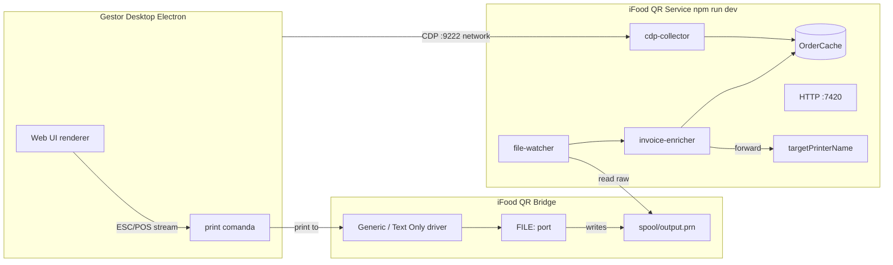

# Architecture

## Overview

The iFood QR Service runs locally on Windows and:

1. **Captures** order metadata from Gestor Desktop via CDP.
2. **Enriches** print payloads with a QR code when a comanda is printed.
3. **Exposes** HTTP API for health, cache, and enrichment.

## Components

| Component | Path | Role |
|-----------|------|------|
| Service entry | `src/service/main.ts` | Orchestrates collectors, HTTP API, enricher |
| CDP collector | `src/collector/cdp-collector.ts` | Order capture from Gestor network |
| Order cache | `src/collector/order-cache.ts` | In-memory + disk cache for print lookup |
| Invoice enricher | `src/qr/invoice-enricher.ts` | QR payload generation and ESC/POS injection |
| File watcher | `src/print/file-watcher.ts` | Watches `output.prn` for new prints |
| Print handler | `src/print/print-job-handler.ts` | Extracts displayId, enriches, forwards |
| Raw forwarder | `src/print/raw-forwarder.ts` | Dispatches raw/text to the destination printer |
| HTTP API | `src/service/http-api.ts` | `/health`, `/orders`, `/print/enrich`, `/diagnostics` |

## Data flow (happy path)

1. User starts `npm run dev` → service listens on `7420`, connects CDP to `9222`.
2. User launches Gestor via `.ifood-qr.lnk` → CDP port 9222.
3. New order arrives → CDP ingests API response → `[PEDIDO CAPTURADO]`.
4. User prints comanda on "iFood QR Bridge" → spooler writes `output.prn`.
5. File watcher detects the file, extracts displayId, looks up cache, injects QR, forwards.

## Out of scope

See [ADR-004](../adr/004-deprecated-approaches.md): browser widget, proxy, PORTPROMPT,
Electron main-process hook.

## Related docs

- [Gestor Desktop integration](./gestor-desktop-integration.md)
- [Print pipeline](./print-pipeline.md)
- [Configuration](./configuration.md)
